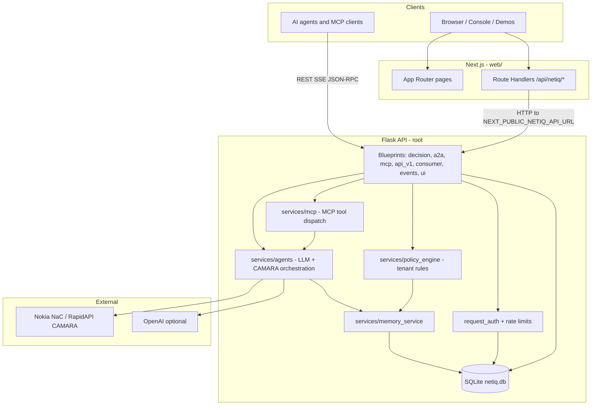

# NetIQ

**NetIQ** is a trust-and-decision layer over **Nokia Network as Code** / **GSMA CAMARA** telco APIs. Clients send `phone`, `intent`, and `context`; the platform returns a structured decision (e.g. ALLOW, VERIFY, BLOCK) with confidence, reasons, trace, and cross-sector **phone-number memory**. The same engine is exposed over **REST**, **MCP** (stdio + HTTP), and **A2A**.

**Stack (summary):** Python **Flask** API + **SQLite** + optional **OpenAI**; **Next.js 15** (App Router) + **React 19** + **Tailwind** for the console and marketing site. The Next app lives in **`web/`** with its own `package-lock.json` (no npm **workspace** hoist to the repo root — that pattern broke Vercel serverless traces).

---

## Architecture

### Request flow (typical decision)

1. **Ingress** — JSON arrives on `/decision/run`, `/decision/stream`, `/mcp`, `/a2a/*`, or `/consumer/chat/*` (see `routes/`). Optional **Bearer API key** resolves to an account (`services/request_auth.py`, `database/db.py`).
2. **Routing** — Intent is normalized (`services/intent_mapper.py`). **Agent** mode runs the LLM-led pipeline (`services/agents/`); **policy** mode uses tenant rules (`services/policy_engine.py`).
3. **Signals** — CAMARA calls go through the integration layer (`integrations/`) using **RapidAPI** credentials from env (`config.py`).
4. **Memory** — Cross-sector risk memory is read/written per phone (`services/memory_service.py`).
5. **Persistence** — Decisions and audit metadata land in **SQLite** unless configured otherwise (`DATABASE_URL`).

### Protocol surfaces (same core logic)

| Surface | Entry |
|--------|--------|
| REST | `routes/decision.py` — `/decision/run`, `/decision/stream`, `/agent/run` |
| MCP HTTP | `routes/mcp_http.py` — `POST /mcp` (JSON-RPC) |
| MCP stdio | `mcp_server.py` — local process for Claude/Cursor-style hosts |
| A2A | `routes/a2a.py` — Agent Card + task endpoints |
| Console API | `routes/api_v1.py` — sessions, keys, account JSON |

### Frontend ↔ backend (split deploy)

In production the UI often sits on **Vercel** and the API on **Render** (or similar). The browser calls Flask **directly** using `NEXT_PUBLIC_NETIQ_API_URL`. Next **Route Handlers** under `web/app/api/netiq/*` proxy some flows server-side (e.g. demos) using `NETIQ_DEMO_API_KEY` so secrets stay off the client.

**Vercel:** Set the project **Root Directory to `web`** (not the repo root). The deployed app root must be **`/var/task`** = contents of `web/`, so **`.next`** and **`node_modules`** live in the same tree. If the project root is the **repository** (parent of `web/`), you get paths like **`/var/task/web/node_modules/...`** while the runtime looks for **`.next`** under **`/var/task/.next`** — copying only **`web/.next`** to the repo root (legacy sync) **without** hoisting **`node_modules`** causes **`ENOENT … /var/task/.next/build-manifest.json`** and **`Cannot find module 'react/jsx-runtime'`**. This repo’s root **`npm run build`** no longer runs that sync; use **`web/vercel.json`** defaults. Set **`NEXT_PUBLIC_NETIQ_API_URL`** and **`NETIQ_DEMO_API_KEY`** (if used) on the Vercel project.

**Docker:** `Dockerfile` builds Next from **`web/`** alone. Root **`npm run build`** is **`npm run build --prefix web`** only.

---

## Repository layout

| Path | Role |
|------|------|
| `app.py` | Flask app factory, CORS, blueprint registration |
| `config.py` | Environment-driven settings |
| `routes/` | HTTP blueprints (REST, MCP, A2A, portal JSON API, consumer) |
| `services/` | Agents, policy engine, memory, MCP tools, rate limiting |
| `database/` | SQLite schema, migrations, API key hashing |
| `integrations/` | CAMARA / NaC client wiring |
| `mcp_server.py` | Stdio MCP server for local IDE integration |
| `web/` | Next.js UI — console, simulator, docs, sector demos |
| `Dockerfile`, `Dockerfile.api`, `render.yaml` | Container / Render deployment |
| `web/vercel.json`, `scripts/sync-vercel-next-output.js` (optional legacy) | Vercel: **Root Directory = `web`**; do not split `.next` and `node_modules` across `/var/task` vs `/var/task/web` |

---

## Running locally

Use **two terminals**: (1) Flask — `python app.py` from the repo root with a `.env` containing at least `RAPIDAPI_KEY` for real CAMARA calls; (2) Next — **`npm ci --prefix web`** (or `cd web && npm ci`) then **`npm run dev --prefix web`** from the repo root, after copying `web/.env.example` to `web/.env.local` with `NEXT_PUBLIC_NETIQ_API_URL=http://localhost:8080`.

More detail: **`web/README.md`** (frontend and demo setup).
